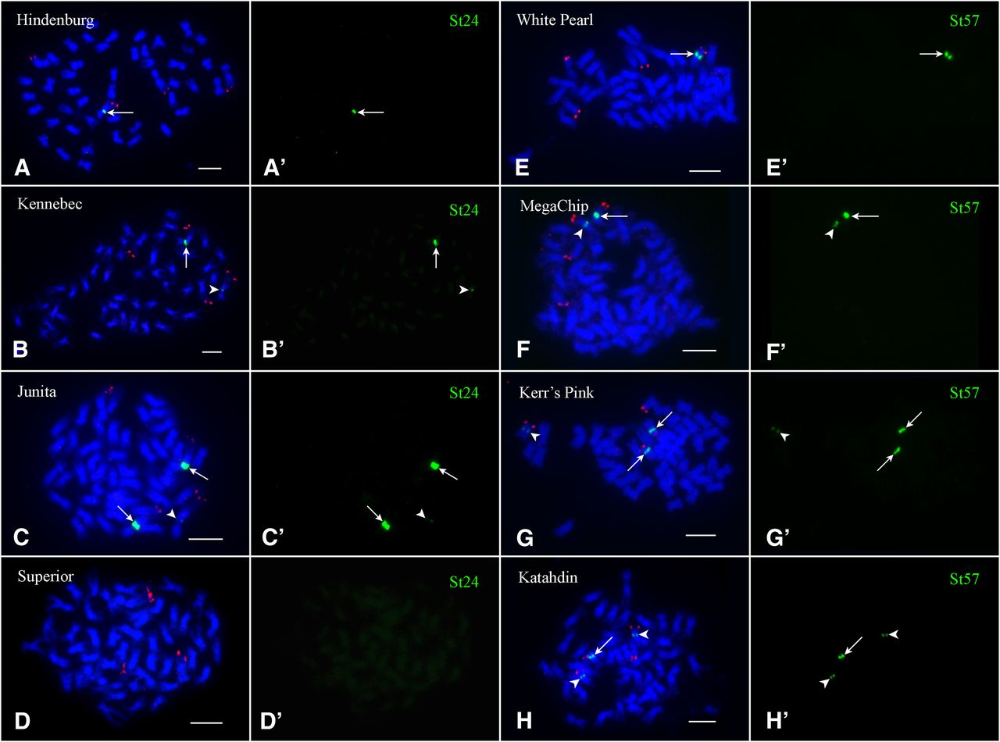

Analysis of satellite polymorphism between potato genotypes Superior and Russet Burbank

## Premise:

Using reference genotype DM1-3, a doubled monoploid,  identified a 
Cen1-associated repeat St24. A cloned St24 sequence was deposited (GenBank: JQ731640.1)

Wang et al (2014) reported different haplotypes associated with the
centromeres of three potato chromosomes among cultivated tetraploid varieties. Some
haplotypes are composed of long arrays of chromosome-specific satellite repeats, whereas
other haplotypes lack the tested satellite repeats.

For example, St24 was shown to label different numbers of chr1 homologues in different
tetraploid cultivars:

Image is Figure 3 from Wang et al (2014)


A-D: FISH mapping of the Cen1-specific satellite repeat St24 in cultivars Hindenburg,
Kennebec, Juanita and Superior, respectively. Potato chromosome 1 was identified by BAC 
clone 96H03 (red signals). Arrows point to strong FISH signals and arrowheads point to 
weak FISH signals. Chromosomes are counterstained with DAPI (blue).

A'-D': St24 FISH signals digitally separated from panels A-D.

Summary of FISH results of three centromeric repeats.
Table adapted from Table 1 of Wang et al (2014) Genetics
I've also included NCBI SRR run identifier numbers for cultivars with DNAseq data.

|    Cultivar    |  Origin | St24 (Cen1) | St3.58 (Cen2) | St57 (Cen7) | NCBI SRR                                                          |
|:--------------:|:-------:|:-----------:|:-------------:|:-----------:|-------------------------------------------------------------------|
| Atlantic       | US      | 2           | 1             | 1S,2W       | SRR5349578;SRR2070063;SRR2070065                                  |
| Atzimba        | Mexico  | 1           | 4             | 1S,2W       | NA                                                                |
| Freedom Russet | US      | 3           | 2             | 1           | NA                                                                |
| Hindenburg     | Germany | 1           | 2             | 2S, 1W      | NA                                                                |
| Juanita        | Mexico  | 2S, 1W      | 1             | 1           | NA                                                                |
| Kalkaska       | US      | 3           | 2             | 1S, 1W      | SRR5349579                                                        |
| Katahdin       | US      | 3           | 2             | 1S, 2W      | SRR5349594                                                        |
| Kennebec       | US      | 1S, 1W      | 2             | 1           | SRR5349593                                                        |
| Kerr's Pink    | UK      | 2           | 1             | 2S, 1W      | NA                                                                |
| MegaChip       | US      | 3           | 2             | 1S, 1W      | NA                                                                |
| Norkotah*      | US      | 2           | 2             | 1S, 2W      | SRR5349581                                                        |
| Ranger Russet  | US      | 2           | 4             | 1S, 1W      | NA                                                                |
| Roslin Eburu   | UK      | 1           | 2             | 3           | NA                                                                |
| Russet Burbank | US      | 4           | 2             | 1S, 2W      | SRR5349587                                                        |
| Snowden        | US      | 1S, 1W      | 2             | 1S, 1W      | SRR5349577                                                        |
| Superior       | US      | 0           | 2             | 1           | SRR5349638;SRR2070067;SRR2069942;SRR2069941;SRR2069940            |
| White Pearl    | US      | 1           | 0             | 1           | NA                                                                |

Update: SRR entries SRR5349647, SRR5349688, SRR5349689, SRR5349690, SRR5349646, SRR5349643,
SRR5349641 and SRR5349698 are amplicon sequencing data that should be withheld.

## Aims

1. Identify RB-specific and -biased k-mers in medium depth whole genome short read data.
2. Assemble reads containing RB-specific k-mers. As a sanity check, determine relative abundance of 
   St24 k-mers.
3. Align RB and Superior reads back to contigs from step 2.

## Procedure

### Aim 1

1. Load necessary software. Install miniconda somewhere you can write to.

```
cd /share/comailab/kramundson/bruno_move_to_share/potato_tandem_repeats
module load sratoolkit/2.8.1-3 jellyfish/2.2.7
```

2. Download reads from NCBI SRA. Reads should be interleaved and uncompressed.

```
mkdir data
mkdir data/reads
SUP="SRR2069940 SRR2069941 SRR2069942 SRR2070067 SRR5349638"
RUS="SRR5349587"

# had to change this command to output interleaved uncompressed reads
# fastq-dump --gzip -B --split-3 -O data/reads -defline-seq '@$ac.$si/$ri' --defline-qual '+' $SUP $RUS

# updated fastq dump
fastq-dump -B --split-spot -O data/reads --defline-seq '@$ac.$si/$ri' --defline-qual '+' $SUP $RUS
``` 

3. Since Superior has multiple libraries/sequencing runs, concatenate all fastq files that
correspond to Superior. No need to do this for Russet Burbank reads.

```
cd data/reads
cat SRR5349638.fastq SRR2070067.fastq SRR2069942.fastq SRR2069941.fastq SRR2069940.fastq > superior_all.fastq
```

4. Count 31mers in each set of combined fastq files. Adjust the hash size according to the
sequencing dataset at hand. This is described in the Jellyfish manual. The calculations
are also done here as an example:

* For combined Superior reads:
  * Assumed error rate: 0.01
  * Potato genome size: 844e6
  * Read length: 2 x 150
  * Number of read pairs: 166743464
  * Sequencing coverage: 2 * 150 * 166743464 / 844e6 = ~59.27x
  * Hash size: 844e6 + (844e6 * 59.27 * 0.01 * 31) = ~16.35G

Round up to 17G.

```
jellyfish count -m 31 -s 17G -t 12 -C -o data/counts/superior_counts.jf data/reads/superior_all.fastq \
    && jellyfish histo data/counts/superior_counts.jf > data/histos/superior_all_counts.txt &
```


* For Russet Burbank
  * Assumed error rate: 0.01
  * Potato genome size: 844e6
  * Read length: 2 x 125
  * Number of reads: 54659802
  * Sequencing coverage: 2 * 125 * 54659802 / 844e6 = ~16.2x
  * Hash size: 844e6 + (844e6 * 16.2 * 0.01 * 31) = ~5.01G

Round up to 6G.

```
jellyfish count -m 31 -s 6G -t 12 -C -o data/counts/rb_counts.jf data/reads/SRR5349587.fastq \
    && jellyfish histo data/counts/rb_counts.jf > data/histos/rb_all_counts.txt &
```


5. Extract all 31mers from St24 using ```./scripts/get_kmers_in_order.py```. This script
returns a flat .txt file of all k-mers in St24.fasta using a simple sliding window. One
mer per line, with mers ordered by appearance (from 5' to 3') in St24. Note, to be
compatible with Jellyfish, I kept the lexicographically smaller of the k-mer and its
reverse complement. Run this script at the command line as follows:

```
python scripts/get_kmers_in_order.py -f data/St24.fasta -k 31 -o data/coord_ordered_St24_31mers.txt
```

6. As a sanity check, get counts of canonical St24 k-mers in each set of WGS reads.
This could also be done for the other known repeat families in potato.

```
while read i
do
    jellyfish query data/counts/superior_counts.jf $i >> superior_St24_counts.fasta
    jellyfish query data/counts/rb_counts.jf $i >> rb_St24_counts.fasta
done < coord_ordered_St24_31mers.txt
```

TODO: put in these plots


From this plot, an RB-biased region near the center of the monomer is already evident. We
can't yet say that the rest of the monomer is RB-specific, as relying on exact k-mer
matches is likely prone to undercounting. Put another way, there could still be diverged
St24 sequences in both genotypes. This is the motivation for Aims 2 and 3.

7. Construct 2-D scatter plot of k-mer counts in Superior and Russet Burbank, then label
k-mers of St24 and other known repeats on the plot. See Xiaomin Tang et al (2014) for a
table of publications describing repeats in potato and its tuber bearing relatives.

### Aim 2 (still in outline format, Kirk to work out the specifics)

1. Extract reads containing RB-specific k-mers

2. Assemble reads containing RB-specific k-mers. KRA to compare to TAREAN, which
does a reasonable job of getting long monomers of high-copy repeats from low coverage
data.

3. Align reads from RB and Superior back to contigs with signs of tandem duplication.

4. Rank contigs by contrast in mapped fragment abundance (RPKM?) difference between RB and
Superior. This could yield part or all of St24.

5. Assess candidate contigs for overlapping RB-specific or strongly RB-biased k-mers.
